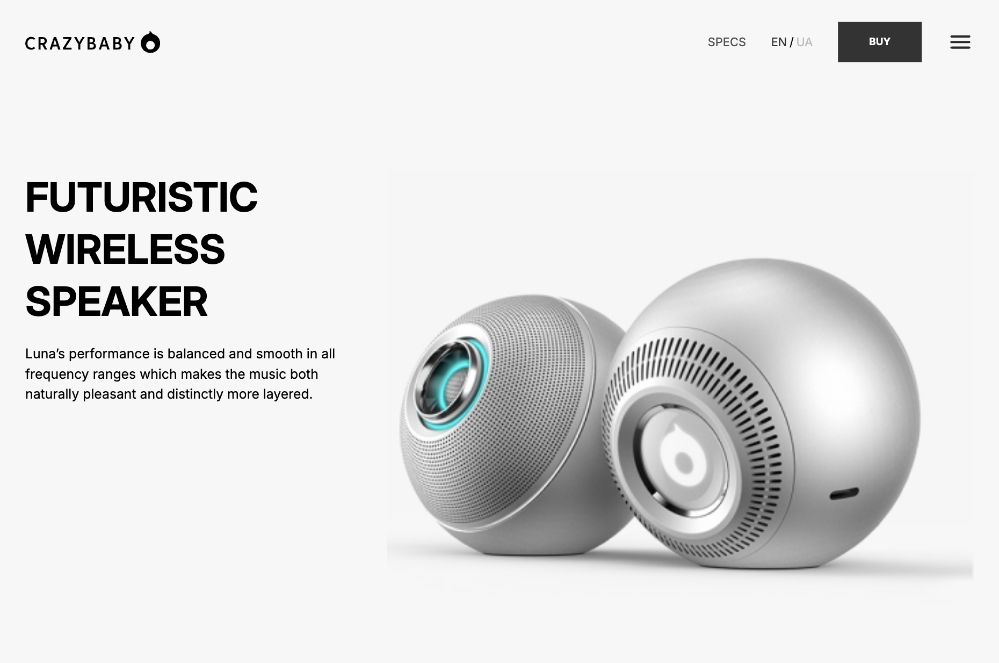
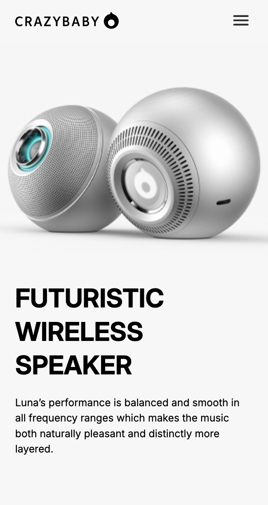

# Kickstarter Landing Page

This is a responsive landing page designed and developed to meet the requirements, including key features such as smooth scroll, hover effects, and interactive elements.

## Table of contents

- [Overview](#overview)
  - [The challenge](#the-challenge)
  - [Getting started](#getting-started)
  - [Screenshot](#screenshot)
  - [Links](#links)
- [My process](#my-process)
  - [Built with](#built-with)
  - [Features](#features)

## Overview

### The challenge

Users should be able to:
  - Navigate seamlessly through the site on different devices with a smooth scroll.
	- Interact with various sections including “About Us,” “Benefits,” “Technology,” and more.
	- Submit a contact form without errors, ensuring data is cleared and the page is scrolled to the top.
	- Experience animated icons, buttons, and elements with hover effects.

### Getting Started

Prerequisites

To run this project locally, ensure you have the following installed:
-	Node.js: Version 14.x
- npm: Comes with Node.js (used for installing dependencies)
- Git: For cloning the repository

Installation
- 1. Clone the Repository
      git clone https://github.com/NKoshmak/kickstarter_landing.git
- 2. Navigate to the Project Directory
      cd kickstarter_landing
- 3. Install Dependencies
      npm install
- 4. Run the Project Locally
      npm start
- 5. Open your browser and navigate to http://localhost:3000.

### Screenshots

#### Screenshot

### Links

- [Solution URL](https://github.com/NKoshmak/kickstarter_landing)
- [Live Site URL](https://nkoshmak.github.io/kickstarter_landing/)

## My process

### Built with

- Semantic HTML5
- CSS/SASS
- BEM Methodology
- JavaScript

### Features
- Responsive Layouts
- Smooth scroll navigation with hover effects for interactive links.
- Interactive icons, buttons, and images that change on hover.
- Validated contact form with no 405 errors and an auto-clear feature after submission.
- A smooth scrolling “Back to Top” arrow icon in the footer.
